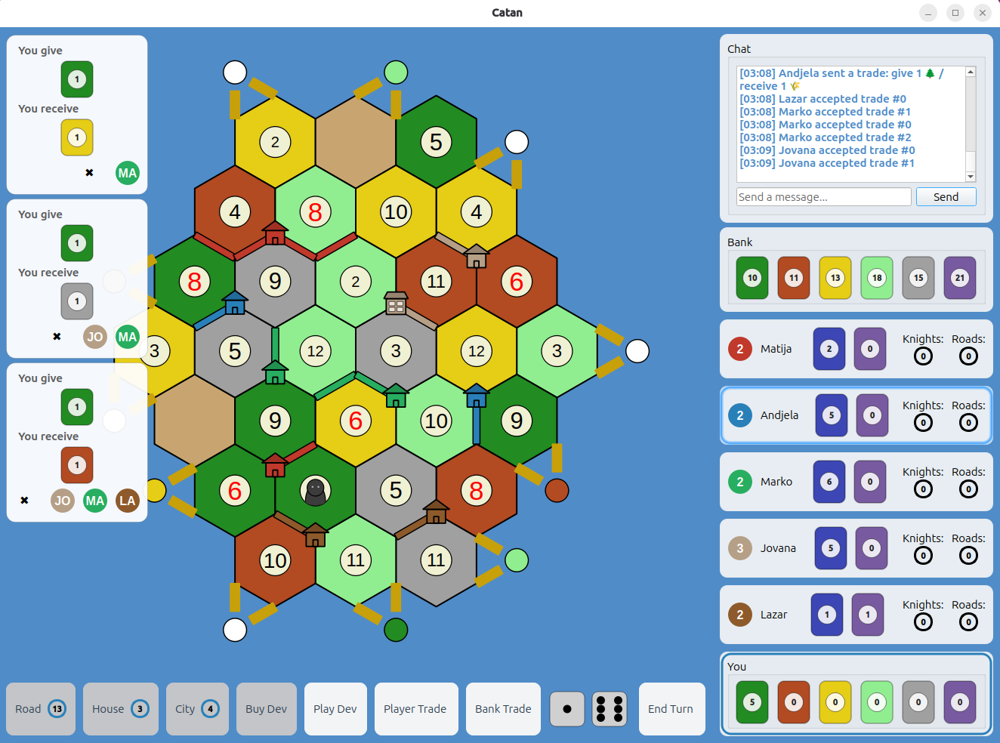

# Catan Frontier Settlements

**Catan: Frontier Settlements** is our implementation of the famous board game. The project is built as a networked multiplayer application, allowing players to connect from different devices and play together in real time.



In addition to the full core gameplay, this version includes several extra features:
- **Parallel Game Sessions:** The server supports multiple game rooms at once, allowing different groups to play separate matches simultaneously.
- **Customizable Game Rooms:** The host can configure settings such as the number of players, victory point threshold, and map options.
- **In-Game Chat:** Players can communicate and negotiate during the match.
- **Game History and Statistics:** After each game, players can review match data and statistics. 
- **Custom and Random maps:** The game supports randomized standard and extended boards from the original game, along with any custom map configuration.
- **Ascii map:** Made in the initial phase of the project for testing.

## Installation

The following is required to build and run the project:

- C++ compiler, version at least C++17
- Qt 6 SDK, recommended version at least 6.2
- CMake, version at least 3.16
- [nlohmann](https://github.com/nlohmann/json)
- [protobuf](https://protobuf.dev/)
- [Catch2](https://github.com/catchorg/Catch2)

Additional libraries (nlohmann, protobuf, and catch2) can be installed using the command:

```
vcpkg install json nlohmann-json protobuf catch2
```

Note: The Catch2 library will be installed by running the cmake file.

## Client configuration

Before running the application, you need to configure the client to connect to the server:

- File path: System local app storage location resources/config.ini
- Settings: Update the server_ip in this file to the address of the machine running the server.

## Build process

- clone the repository:
```
git clone https://gitlab.com/matf-bg-ac-rs/course-rs/projects-2025-2026/catan-frontier-settlements
cd catan-frontier-settlements
```
- create build directory and run cmake:
```
mkdir build && cd build
cmake ..
make
```

## Demo:
[demo video](https://drive.google.com/file/d/1Pya67nALP-7X76x5xOPm5f9Pppxsmphd/view?usp=sharing)

## Team members:

 - <a href="https://gitlab.com/markocv">Marko Cvijetinović 7/2022</a>
 - <a href="https://gitlab.com/andjaa">Andjela Spasic 166/2022</a>
 - <a href="https://gitlab.com/jov580">Jovana Lazic 21/2022</a>
 - <a href="https://gitlab.com/LazarRajcic">Lazar Rajcic 50/2022</a>
 - <a href="https://gitlab.com/MatijaRadulovic">Matija Radulovic 5/2022</a>