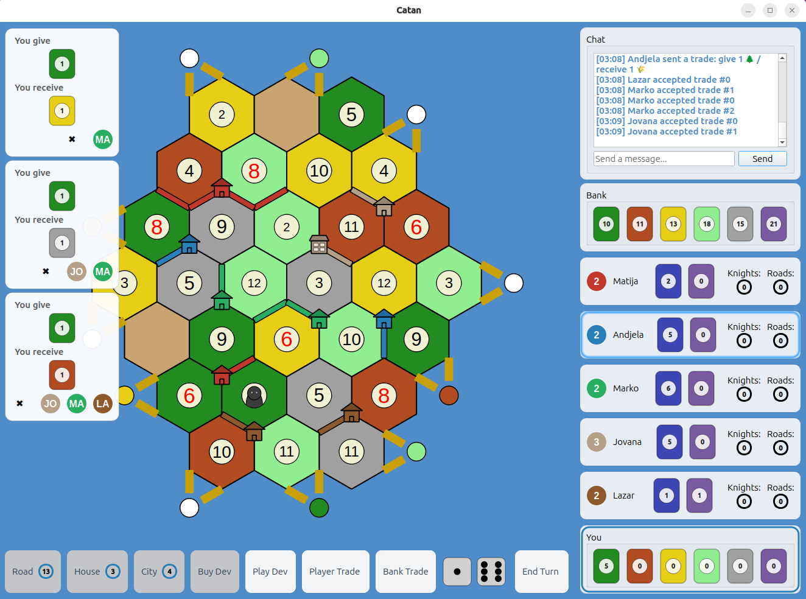

# Catan Frontier Settlements

Multiplayer implementation of the classic Catan board game built in **C++ and Qt**, featuring a **client-server architecture**, real‑time gameplay synchronization, customizable game sessions, in‑game chat, and match statistics.



**Tech focus:**  
C++17 • Qt6 • Client–Server Architecture • Network Programming • Protobuf • CMake • State Machine Architecture • Design Patterns

## Features

The game includes the full core Catan gameplay, along with several additional features:

- **Parallel Game Sessions:** the server supports multiple game rooms simultaneously, allowing different groups to play separate matches.
- **Customizable Game Rooms:** the host can configure game parameters such as number of players, victory point threshold, and map options.
- **In‑Game Chat:** players can communicate and negotiate during gameplay.
- **Game History and Statistics:** match statistics and history are recorded and available for review after each game.
- **Custom and Random Maps:** supports both randomized standard/extended maps and fully custom board configurations.
- **ASCII Map Prototype:** used during early development phases for testing core game mechanics.

## Contributions

**GameSession**, **GameController**, and the **Move system** were my area: the engine layer for rules, state, and everything that happens on a player's turn.

### Primary contributions

- **GameSession and GameController:** full match lifecycle. Turn order, phase transitions, which actions are valid when. The GUI doesn't decide any of this; it just reflects what the engine says.
- **The move system:** every player action is a move with `isValid()` and `apply()`. The same `isValid()` that enforces rules also drives GUI highlighting and board shake on invalid placement.
- **Server-authoritative design:** all moves are validated on the server before taking effect. Every client sees the same game state.
- **Dual-mode phase state machine:** tracks both game phase and current move sequence, with input-blocking guards. Invalid actions aren't filtered in the UI, they're not offered in the first place.

### Architecture and design patterns

- **Command:** `isValid()`/`apply()` on every move type
- **State Machine:** dual-mode TurnPhase transitions with input-blocking guards
- **Observer** (Qt signals/slots): GUI reacts to engine state changes
- **Fake** test double: `makeTestBoard()` for isolated unit testing

### Additional contributions

- Built `TestHelper.h`, the shared Catch2 infrastructure used across the team. Fake board with `forcePhase()`/`forceCurrent()` helpers, covering move validation and phase transitions. Found several real move-validation and phase-transition bugs before integration.
- Houses, cities, roads, robber (Qt); **AudioManager**; game config system.
- GUI refactoring and styling improvements across the application.
- Maintained and populated **GameHistory**.
- Set up Git hooks and kept the development workflow sane. Coordinated refactoring and helped the team figure out where things fit.
- Designed architecture sketches and the initial UML class diagram.

### Collaboration

[@MatijaRadulovic](https://github.com/MatijaRadulovic) built the networking layer; we worked out how moves and game events get passed between the engine and the network.

## Demo

[demo video](https://drive.google.com/file/d/1Pya67nALP-7X76x5xOPm5f9Pppxsmphd/view?usp=sharing)

## Installation

The following is required to build and run the project:

- C++ compiler with C++17 support
- Qt 6 SDK, recommended version 6.2 or newer
- CMake 3.16 or newer

### Optional

- Conan 2, if building with Conan
- Protobuf, if building with plain CMake
- Catch2, if building tests with plain CMake

Protobuf and Catch2 can be installed using:

```bash
vcpkg install protobuf catch2
```

## Client configuration

Before running the application, configure the client to connect to the server:

- File path: local app storage location `resources/config.ini`
- Setting to update: `server_ip`
- Set it to the address of the machine running the server

## Build process

Clone the repository:

```bash
git clone https://github.com/andja45/catan-frontier-settlements
cd catan-frontier-settlements/Catan
```

### Plain CMake build

If you build without Conan, make sure Qt and Protobuf are installed locally and available to CMake.

You may need to point CMake to your Qt installation:

```bash
cmake -B build -DCMAKE_PREFIX_PATH=/path/to/Qt/6.x/gcc_64
cmake --build build
```

### Conan build

If you build with Conan, make sure Conan is installed and provide your local Qt path.

**Option 1: environment variable**

```bash
export QT_DIR=/path/to/Qt/6.x/gcc_64
```

**Option 2: Conan profile/config**

Add this to your local Conan profile:

```ini
[conf]
user.qt:path=/path/to/Qt/6.x/gcc_64
```

Then run:

```bash
conan install . --build=missing
conan build .
```

### Optional: create a Conan package

If you want to package the project into your local Conan cache:

```bash
export QT_DIR=/path/to/Qt/6.x/gcc_64
conan create . --build=missing
```

## Team members

 - <a href="https://gitlab.com/markocv">Marko Cvijetinović</a>
 - <a href="https://gitlab.com/andjaa">Andjela Spasic</a>
 - <a href="https://gitlab.com/jov580">Jovana Lazic</a>
 - <a href="https://gitlab.com/LazarRajcic">Lazar Rajcic</a>
 - <a href="https://gitlab.com/MatijaRadulovic">Matija Radulovic</a>
